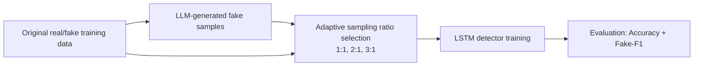

# DS8008 Final Project: Fake News Detection Reproduction

This repository is a course reproduction project based on:
**Tong et al. (ACL 2025)** — *Generate First, Then Sample: Enhancing Fake News Detection with LLM-Augmented Reinforced Sampling*.

Paper URL: https://aclanthology.org/2025.acl-long.1182/

## What we implemented (3 required experiment settings)

We now run exactly three settings aligned with the paper's core idea:

1. **Baseline**
   - Train detector with original real + original fake articles only.
2. **Baseline + generated fake samples**
   - Add synthetic fake articles to augment fake class representation.
3. **Baseline + generated fake + dynamic ratio sampling**
   - Use an **RL-inspired adaptive sampling** heuristic to choose fake:real ratio from `{1:1, 2:1, 3:1}` each epoch.

### RL-inspired adaptive sampling (simplified due to compute/time)
At each epoch:
1. Train using one candidate fake:real ratio from `{1:1, 2:1, 3:1}`.
2. Evaluate **fake-F1** on a validation split.
3. Choose the next epoch ratio based on best recent validation fake-F1.

This is a practical approximation of the paper's reinforcement-style sampling, designed for limited compute and deadline constraints.

---

## Methodology diagram



---

## Paper vs implementation comparison

| Paper method | Our implementation | Match level | Reason for differences |
|---|---|---|---|
| LLM generates fake news in multiple styles | Uses pre-generated synthetic fake-news corpus from project data folder | **Partial** | Generation step already prepared beforehand; we focus on detector-side reproduction |
| Reinforcement learning dynamically samples fake:real ratio | RL-inspired adaptive heuristic picks ratio from `{1:1, 2:1, 3:1}` using validation fake-F1 feedback | **Partial** | Simplified policy to keep runtime feasible on course compute budget |
| Detector trained with generated + original data | LSTM detector trained in three controlled settings (baseline, +generated, +generated+adaptive) | **Full/Partial** | Full for augmentation comparison design; detector architecture differs from some paper variants |
| Emphasis on fake-class improvement | Reports fake-F1 in adaptive setting and accuracy across all settings | **Full** | Directly evaluates fake-news detection objective |

---

## Project structure

- `src/main.py`: Runs the 3 experiment settings and prints summary.
- `src/TrainAndEvaluateClassifier.py`: Loads real/fake/generated training groups.
- `src/TrainAndEvaluateLSTM.py`: LSTM training/evaluation + adaptive sampling experiment.
- `Data/train/...`: Real, fake, and generated fake training articles.
- `Data/test/...`: Held-out testing articles.

## How to run

```bash
python src/main.py
```

If runtime is high, keep reduced training mode enabled in `src/main.py` (`use_all = 0`).
